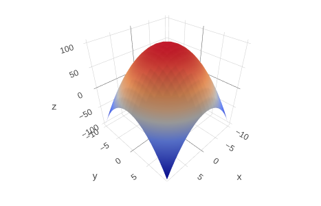

# augment

## A Scala 3 alternative to comprehensions


This is a zero-dependency alternative to [comprehensions](https://en.wikipedia.org/wiki/List_comprehension) that requires no special syntax, and as such can be used from Java and other JVM languages.\
Overall it provides a concise, direct-style notation that handles plain and container types indifferently, which can simplify effect handling.\
It also inherently distinguishes the "rectangular" from everything else - or if you prefer, array comprehensions from list comprehensions, the parallelizable from the sequential, and applicatives from monads.

## Overview

Say you have an existing function f0 of two variables, something along the lines of *def f0(a: Int, b: Int) = a\*a + b\*b*. Then if you write
```scala
val f = augment(f0)
```
	
you effectively have a new function f that can replace f0, in that *f(a,b)* is the same as *f0(a,b)* for any integers a and b.  But it now has additional behavior: for instance if A and B are ranges of integers, then
```scala
f(A, B).plot()
```

will display a 3D graph using HTML.  The new function by itself does the work of a comprehension, since
```scala
f(A, B)
```
contains the same values as
```scala
for
  a <- A
  b <- B
yield
  f0(a, b)
```

More general comprehensions can be replicated by changing the argument types: instead of sequences of integers, they could be functions that return sequences, as shown below.

There are more detailed explanations in the [documentation](http://computist.co/augment.html)

## Quick start

(For Java and Clojure, setup and examples follow further below.)\
In Scala, you can add the following to build.sbt:
```scala
libraryDependencies += "co.computist" %% "augment" % "0.0.2"
```

Imports to get you started:
```scala
import augmented._
import augmented.given
```

## Examples

### Pythagorean triples

```scala
select(1 to n, _ to n, _ to n, (a, b, c) => a * a + b * b == c * c)
```

### Pascal's triangle

```scala
binomialCoefficient(0 to n, 0 to _)
```

### Tetrahedron

```scala
select(1 to n, 1 to _, 1 to _)
```


### Permutations

```scala
def prepend[A] = augment((a: A, l: Seq[A]) => Seq(a) ++ l)

def permutations[A](x: Seq[A]): Seq[Seq[A]] =
  prepend(x, a => permutations(x -- Seq(a))) until x == Seq()
```


### Sieve of Erastosthenes (ish)

```scala
val mult = augment((a: Int, b: Int) => a * b)

def primes(n: Int): Seq[Int] =
  complement(mult(primes(sqrt(n)), x => x to n / x), 2 to n) until n == 1
```

### 8 queens problem

```scala
def isSafe(col: Int, queens: Seq[Int]): Boolean = ...

def queens(n: Int, k: Int = 0): Seq[Seq[Int]] =
  prepend(0 until n, queens(n, k + 1), isSafe) until k == n
```

## Applicative examples

### Mixed function arguments
```scala
val mult = augment((a: Int, b: Int) => a * b)
val add = augment((a: Int, b: Int, c: Int) => a + b + c)

mult(4, 5)        // 20
mult(Some(4), 5)  // Some(20)
mult(4, None)     // None

add(4, 5, 6)                    // 15
add(4, 5, Some(6))              // Some(15)
add(Some(4), Some(5), Some(6))  // Some(15)
add(4, None, 6)                 // None
```

### Type propagation: "bubbling up"
```scala
val a = mult(4, 5)    // 20
val b = add(2, a, 3)  // 25
val c = mult(4, b)    // 100

val n = mult(4, Success(5)) // Success(20)
val p = add(2, n, 3)        // Success(25)
val q = mult(4, p)          // Success(100)
q.value()                   // 100

val x = mult(4, Future(5))  // Future(<not completed>)
val y = add(2, x, 3)        // Future(<not completed>)
val z = mult(4, y)          // Future(<not completed>)
z.value()                   // 100
```

## IO

### Basic IO / deferred valuing
```scala
val nameFromIO =
  sequence(
    println("What is your name?"),    // ordinary println and readLine, not "lifted" versions
    scala.io.StdIn.readLine,
    name => { println(s"Hello, $name\n"); name }
  )
val name = nameFromIO.value() // name is not retrieved from command line until value() is called

val ratioIO =
  sequence(
      5.0,
      Math.sqrt,
      _ + 1,
      _ / 2.0
  )
val ratio = ratioIO.value() // ratio is not calculated until value() is called 
```

### IO with retries
```scala
val n = 
  sequence(
    println("Enter a number: "),
    scala.io.StdIn.readLine,
    _.toInt
  )
val p = add(4, 5, n)
val res = mult(4, p)
res.retry(2).value() // will ignore a duff entry or two
```

### IO with retries: Cats Effect version
```scala
given Effects[cats.effect.IO] = Effects()

// rest of code is identical
// res is now of type cats.effect.IO
```

### IO with retries: ZIO version
```scala
given Effects[zIO] = Effects()

// rest of code is identical
// res is now of type ZIO[Any, IOException, Int]
```

### Cats Effect example: sequential vs parallel
```scala
def f(n: Int) =
  cats.effect.IO:
    Thread.sleep(250)
    n * 10

// cats.effect.IO computations that produce the same result, either sequentially or in parallel
add(f(3), f(4), f(5))                 // parallel
image(f(3), f(4), f(5), _ + _ + _)    // parallel
(f(3), f(4), f(5)).mapN(_ + _ + _)    // sequential
(f(3), f(4), f(5)).parMapN(_ + _ + _) // parallel

add(f(3), f(4), f(5)).value()         // 120
```

### ZIO example: reading/sending over channel
```scala
def readZIO[A](ch: Channel[A])        = ZIO.attempt(ch.read())
def sendZIO[A](ch: Channel[A], a: A)  = ZIO.attempt(ch.send(a))

// Notations that describe the same effect

// comprehension notation
for
  a <- readZIO(c1)
  b <- readZIO(c2)
  _ <- sendZIO(c3, a + b)
yield()

// ZIO direct
defer {
  val a = c1.read()
  val b = c2.read()
  c3.send(a + b)
}

// augmented function notation
sequence(
  c1.read(),
  c2.read(),
  _ + _,
  c3.send
)

// or equivalently:
sequence(
  c1.read(),
  c2.read(),
  (a, b) => c3.send(a + b)
)
```

## From Java

### Quick start

You can add the following to the dependencies in a *pom.xml* file:
```xml
<dependency>
  <groupId>co.computist</groupId>
  <artifactId>augment_3</artifactId>
  <version>0.0.3</version>
</dependency>
<dependency>
  <groupId>org.scala-lang</groupId>
  <artifactId>scala3-library_3</artifactId>
  <version>3.3.1</version>
</dependency>  
```

Imports to get you started:
```java
import static augmented.augmentJ.*;
import static java.util.stream.IntStream.range;
```

Although Java 8 is sufficient, Java 11 is recommended since *var* means you can avoid lengthy explicit type names (often with multiple generic parameters).

### Examples

### Pythagorean triples

This can be compared with e.g. https://rosettacode.org/wiki/List_comprehensions#Java

```java
var n = 20;

var triangles =
  select(
    range(1, n),
    a -> range(a, n),
    b -> range(b, n),
    (a, b, c) -> a * a + b * b == c * c);     // [[3 4 5], [5 12 13], [6 8 10], [8 15 17], [9 12 15]]
```

### Propagation of future values

```java
import static mappable.Mapper.mappable;

var mult = augment((Integer a, Integer b) -> a * b);
var add = augment((Integer a, Integer b, Integer c) -> a + b + c);

mult.apply(4, 5);   // here mult returns an ordinary value (20)
add.apply(4, 5, 6); // 15

var executor = Executors.newSingleThreadExecutor();
var futureVal = mappable(4, a -> executor.submit(() -> {Thread.sleep(500); return a;}));

var x = mult.apply(futureVal, 5);
var y = add.apply(2, x, 3);
var z = mult.apply(4, y);   // here mult returns a future value

assertEquals(z.mappable() instanceof FutureTask, true);
assertEquals(z.hasValue(), false);
Thread.sleep(1000);
assertEquals(z.hasValue(), true);
assertEquals(z.value(), (Integer) 100);
```

## From Clojure

### Quick start

You can add the following to the dependencies in a *project.clj* file:
```clojure
[co.computist/augment_3 "0.0.3"]
[org.scala-lang/scala3-library_3 "3.3.1"]
```

### Examples

### Pythagorean triples

```clojure
(defn augment [f] (augmentedClj.augment/apply f))
(def triple (augment (fn [a b c] [a b c])))
(def n 20)

(def triples
  (triple
    (range 1 n)
    #(range % n)
    #(range % n)
    (fn [a b c] (= (+ (* a a) (* b b)) (* c c)))))

(is (= triples [[3 4 5] [5 12 13] [6 8 10] [8 15 17] [9 12 15]]))
```

### Function graph

```clojure
(def squares (augment (fn [a b] (- 100 (+ (* a a) (* b b))))))
(squares 5 5)                                      ; 50
(.graph (squares (range -10 11) (range -10 11)))   ; plots function using HTML / JavaScript / plotly
```


### Propagation of future values

```clojure
(defn mappable [x] (augmentedClj.Mapper/mappable x))

;; this returns a Clojure function, i.e. one that implements IFn
(def mult (augment (fn [a b] (* a b))))
(def add (augment (fn [a b c] (+ a b c))))

(mult 4 5)  ; here mult returns an ordinary value (20)
(add 4 5 6) ; 15

(def futureVal (mappable (future (Thread/sleep 500) (println "done") (+ 1 3))))

(def x (mult futureVal 5))
(def y (add 2 x 3))
(def z (mult 4 y))  ; here mult returns a future value

(is (= (type (. z mappable)) FutureTask))
(is (= (. z hasValue) false))
(Thread/sleep 1000)
(is (= (. z hasValue) true))
(is (= (. z value) 100))
```
